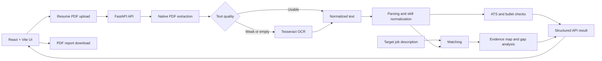
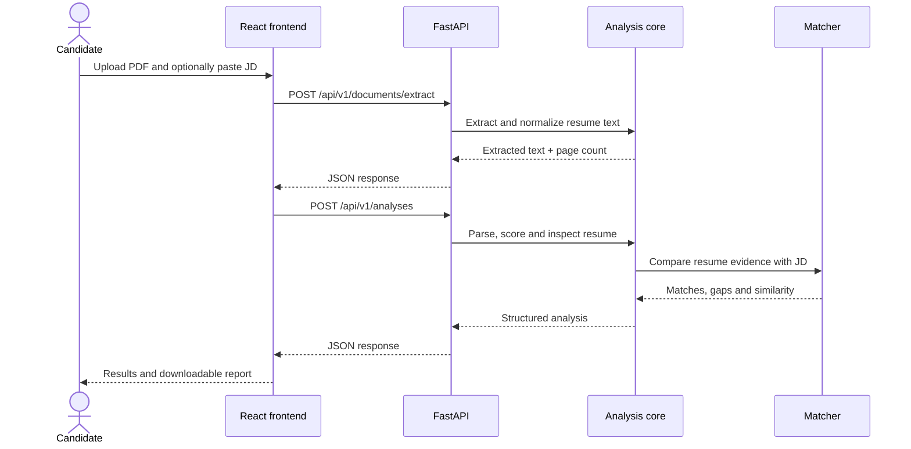

# AI Resume Analyzer

[](https://www.python.org/)
[](https://fastapi.tiangolo.com/)
[](https://react.dev/)
[](https://vite.dev/)
[](LICENSE)
[](https://github.com/rammohanrediee/AI-Resume-Analyzer/actions/workflows/tests.yml)

AI Resume Analyzer is a full-stack resume analysis application with a **React + JavaScript + Vite frontend** and a **FastAPI backend**. It compares a resume with a target job description, performs ATS-style checks, maps job requirements to resume evidence, identifies gaps, and can generate a downloadable PDF report.

The application is designed as a decision-support tool. Its scores and suggestions help candidates review a resume; they do not reproduce a specific employer's ATS or guarantee an interview.

## Tech stack

| Layer | Technology |
|---|---|
| Frontend | React 19, JavaScript, Vite |
| Backend API | FastAPI, Python 3.11+ |
| Resume extraction | Native PDF text extraction with Tesseract OCR fallback |
| Matching | Deterministic lexical matching with optional sentence-transformer embeddings |
| Storage | SQLite or PostgreSQL |
| Testing | Python unittest, coverage, Ruff, pip-audit |
| Deployment | Docker / container-friendly backend, static Vite production build |

## Origin and my contribution

This repository is a substantial re-architecture of
[Deepak Padhi's AI Resume Analyzer](https://github.com/deepakpadhi986/AI-Resume-Analyzer),
used under the MIT License. The upstream project supplied the original
resume-analysis concept, course/video recommendation lists, parser foundation,
and early candidate/admin workflow. The original copyright and license are
retained.

The current project expands that foundation with:

- a separated React frontend and FastAPI backend;
- a hybrid PDF extraction pipeline that keeps reliable text-layer output and applies OCR only to weak or image-only pages;
- a versioned JSON HTTP API;
- resume-to-job evidence mapping;
- deterministic skill normalization, ATS checks, bullet-quality review, and lexical fallbacks;
- optional semantic matching with `sentence-transformers/all-MiniLM-L6-v2`;
- SQLite and PostgreSQL persistence behind one storage interface;
- environment-based API and admin configuration;
- downloadable PDF analysis reports;
- unit, API, architecture, and integration tests;
- Docker and continuous-integration configuration.

See [CONTRIBUTIONS.md](CONTRIBUTIONS.md) for the upstream-to-current comparison and file-level ownership map.

## Current frontend

The active browser interface is in **`web/`** and is built with React, JavaScript, and Vite.

The React application currently provides:

- PDF resume upload and browser preview;
- optional candidate name;
- optional target job description;
- backend health-status checking;
- PDF text extraction through the FastAPI API;
- resume analysis and results views;
- ATS/evidence/gap-oriented result presentation;
- downloadable PDF analysis reports;
- responsive UI components and progress states.

The older Python UI under `frontend/` and the root `app.py` remain in the repository as legacy code, but they are **not the primary frontend documented here**.

## How it works



Semantic matching uses `sentence-transformers/all-MiniLM-L6-v2` when the optional dependency is installed. If the model cannot load, the application falls back to deterministic matching so the main workflow remains available.

## Project structure

```text
.
├── backend/
│   └── app/
│       ├── api/                    # FastAPI routes, middleware, HTTP contracts
│       ├── assets/                 # Backend assets used by reports
│       ├── core/                   # Parsing, scoring, matching and report logic
│       ├── models/                 # Domain and persistence models
│       ├── schemas/                # Request/response schemas
│       ├── services/               # Application use cases and extraction services
│       └── main.py                 # Backend ASGI / CLI entry point
│
├── web/                            # Active React frontend
│   ├── src/
│   │   ├── App.jsx                 # Main application workflow
│   │   ├── api.js                  # FastAPI client
│   │   ├── components/
│   │   │   ├── AppHeader.jsx
│   │   │   ├── ProgressSteps.jsx
│   │   │   ├── ResultsView.jsx
│   │   │   └── UploadView.jsx
│   │   ├── App.css
│   │   ├── tokens.css
│   │   └── main.jsx
│   ├── index.html
│   ├── package.json
│   └── vite.config.js
│
├── frontend/                       # Legacy Python frontend
├── app.py                          # Legacy Python UI entry point
├── tests/                          # Backend, API and architecture tests
├── requirements/                   # Optional semantic/dev dependencies
├── scripts/
├── data/
├── docs/
├── Dockerfile
├── pyproject.toml
└── start-backend.sh
```

## Request flow



## Getting started

### Prerequisites

Install:

- Python 3.11 or newer
- `pip` and `venv`
- Node.js and npm
- Tesseract 5 with English language data for scanned or image-only PDFs

On macOS:

```bash
brew install tesseract
```

Text-based PDFs do not require OCR. Tesseract is used only when a page does not contain enough reliable text.

### Clone the repository

```bash
git clone https://github.com/rammohanrediee/AI-Resume-Analyzer.git
cd AI-Resume-Analyzer
```

### Backend setup

Create and activate a Python virtual environment:

```bash
python3 -m venv .venv
source .venv/bin/activate
pip install -e .
```

Optional semantic matching:

```bash
pip install -r requirements/semantic.txt
```

Development dependencies:

```bash
pip install -r requirements/dev.txt
```

Copy the backend environment example:

```bash
cp .env.example .env
```

### Frontend setup

```bash
cd web
npm install
```

## Running locally

Run the backend in one terminal from the repository root:

```bash
source .venv/bin/activate
python -m backend.app.main
```

The backend listens on `http://127.0.0.1:8001` by default.

You can also use:

```bash
bash start-backend.sh
```

Run the React frontend in a second terminal:

```bash
cd web
npm run dev
```

Vite normally serves the frontend at `http://localhost:5173`.

During local development, Vite proxies requests beginning with `/api` to `http://127.0.0.1:8001`, so the React app can call the backend without hard-coding a local API URL.

FastAPI interactive documentation is available at:

```text
http://127.0.0.1:8001/docs
```

## Configuration

### Backend

The root `.env.example` currently includes:

| Variable | Required | Purpose |
|---|---:|---|
| `SQLITE_DB_PATH` | No | Local SQLite path |
| `ANALYTICS_ENABLED` | No | Enables anonymous aggregate analytics |
| `DB_HOST`, `DB_PORT`, `DB_NAME`, `DB_USER`, `DB_PASSWORD` | No | PostgreSQL connection settings |
| `HF_TOKEN` | No | Hugging Face token for higher-rate model downloads |
| `API_HOST` | No | Backend bind host |
| `PORT` | No | Backend port, default `8001` |
| `RESUME_API_KEY` | No | Enables bearer-token authentication for protected API requests |
| `API_RATE_LIMIT_PER_MINUTE` | No | Per-client POST request limit |
| `ADMIN_USERNAME`, `ADMIN_PASSWORD_HASH` | No | Admin authentication configuration |

Generate an admin password hash with:

```bash
python scripts/hash_admin_password.py
```

### React frontend

The React API client reads:

```text
VITE_API_BASE_URL
```

If it is not set, requests use the current origin and local development relies on the Vite `/api` proxy.

For a separately hosted backend, create `web/.env.local`:

```bash
VITE_API_BASE_URL=https://your-api.example.com
```

Vite environment variables are embedded at build time, so set this before creating a production build.

## API

| Method | Endpoint | Description |
|---|---|---|
| `GET` | `/api/v1/health` | Service health check |
| `POST` | `/api/v1/documents/extract` | PDF upload and text/OCR extraction |
| `POST` | `/api/v1/analyses` | Complete resume and JD analysis |
| `POST` | `/api/v1/analyses/bullet-quality` | Bullet-quality review |
| `POST` | `/api/v1/analyses/jd-gap` | Categorized JD gap analysis |
| `POST` | `/api/v1/analyses/interview-prep` | Interview-question generation |
| `POST` | `/api/v1/reports/pdf` | Generate a PDF analysis report |

Example extraction request:

```bash
curl -X POST http://127.0.0.1:8001/api/v1/documents/extract \
  -H "Authorization: Bearer $RESUME_API_KEY" \
  -F "file=@resume.pdf;type=application/pdf"
```

Example analysis request:

```bash
curl -X POST http://127.0.0.1:8001/api/v1/analyses \
  -H "Content-Type: application/json" \
  -H "Authorization: Bearer $RESUME_API_KEY" \
  -d '{
    "candidate_name": "Asha",
    "resume_text": "Skills: Python, SQL. Built a FastAPI service for analytics reporting.",
    "resume_skills": ["Python", "SQL", "FastAPI"],
    "job_description": "Seeking a data scientist with Python, SQL, model evaluation, and API deployment experience."
  }'
```

## Frontend development

From `web/`:

```bash
npm run dev
npm run lint
npm run build
```

The production build is written to `web/dist/`.

## Backend testing

Run the Python test suite and enforce the project coverage threshold:

```bash
coverage run --source=backend.app -m unittest discover -s tests -v
coverage report -m --fail-under=80
```

The backend test suite covers areas including:

- bounded API uploads;
- native PDF extraction and text normalization;
- OCR selection and fallback behavior;
- persistence and deletion behavior;
- authentication, payload limits and rate limiting;
- parsing, matching, ATS scoring and evidence mapping;
- API and architecture behavior.

GitHub Actions runs Ruff, dependency checks, `pip-audit`, the Python test suite with the coverage threshold, builds the Docker image, starts the backend container, and verifies the health endpoint.

## Deployment

### Backend

The repository includes a `Dockerfile` and `nixpacks.toml` for container-style backend deployment.

Typical backend command:

```bash
bash start-backend.sh
```

For a public deployment, set at least the correct host/port values and use strong secrets for any enabled authentication.

### React frontend

Create a production build:

```bash
cd web
npm install
npm run build
```

Deploy the generated `web/dist/` directory to a static host or CDN.

If the frontend and backend use different public origins, set `VITE_API_BASE_URL` to the backend URL before running `npm run build`.

## Privacy and responsible use

Resume analysis can contain personal information. The application is designed so resume files are processed for analysis rather than treated as permanent user documents.

For non-local deployments:

- use TLS and appropriate access controls;
- keep secrets in the deployment platform's secret manager;
- avoid logging raw resume text or credentials;
- define retention rules for stored analytics;
- treat all match scores as guidance rather than hiring decisions;
- review generated suggestions before using them in a real application.

## Limitations

- The current React upload flow supports PDF resumes; DOC/DOCX files are not supported yet.
- The React client limits selected PDFs to 5 MiB.
- PDF extraction quality depends on the source document's structure and embedded fonts.
- Keyword and embedding similarity do not prove proficiency or job readiness.
- The tool does not emulate proprietary ATS ranking algorithms.
- Suggested bullet rewrites require human verification; unsupported metrics should never be added.
- Semantic results depend on the quality and specificity of both the resume and job description.
- The backend's in-memory rate limiting is per process; multi-worker production deployments need a shared gateway or limiter.

## Contributing

Issues and focused pull requests are welcome. Before submitting a change:

1. Keep analysis logic deterministic where practical.
2. Add or update tests for behavior changes.
3. Run the backend test suite and frontend lint/build checks.
4. Do not commit resumes, credentials, databases, model caches, or generated reports.

## License

This project is available under the [MIT License](LICENSE). The license permits use, copying, modification, distribution, sublicensing, and sale, provided the copyright and permission notice are retained.

The repository retains the required upstream copyright notice:

> Copyright (c) 2022 Deepak Padhi

New re-architecture work is documented in [NOTICE](NOTICE) and [CONTRIBUTIONS.md](CONTRIBUTIONS.md). See [LICENSE](LICENSE) for the complete terms and warranty disclaimer.
